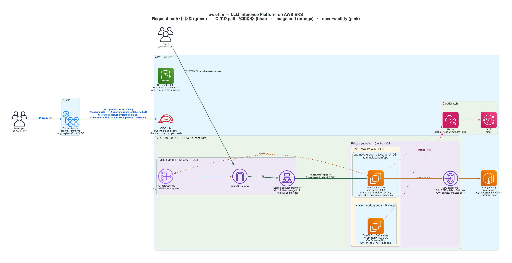
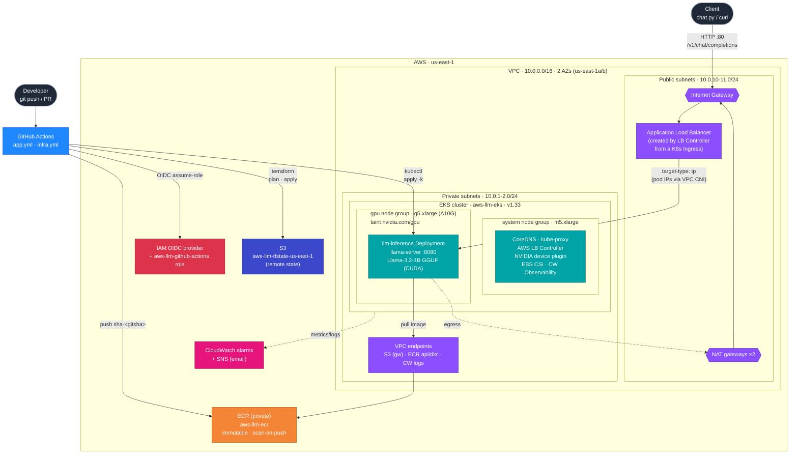

# aws-llm — Architecture

*Rendered with official AWS icons via the [`diagrams`](https://diagrams.mingrammer.com)
library. Regenerate with `python3 docs/architecture_diagram.py` (needs
`brew install graphviz && pip install diagrams`). Each node carries a short
`why:` note explaining the design choice; the four flows are color-coded and
listed in the diagram's title.*

## How it flows

- **Request path ①②③ (green):** a client calls `POST /v1/chat/completions` →
  the internet-facing **ALB** (provisioned by the AWS Load Balancer Controller
  from a Kubernetes `Ingress`) → forwarded straight to the **llama-server pod's
  IP** on a GPU node (`target-type: ip`, via the VPC CNI) → inference runs on the
  NVIDIA A10G and streams back an OpenAI-format response.
- **CI/CD path ⒶⒷⒸⒹ (blue):** a developer pushes / opens a PR → **GitHub
  Actions** assumes the `aws-llm-github-actions` role via OIDC (Ⓐ), pushes the
  image as `sha-<gitsha>` to **ECR** (Ⓑ), runs `terraform plan/apply` against
  **S3 remote state** with a gate on `main` (Ⓒ), and rolls the Deployment with
  `kubectl apply -k` when the cluster is up (Ⓓ).
- **Image pull (orange):** the pod pulls its image from ECR **privately** through
  the **VPC interface endpoints** (ECR api/dkr), keeping that traffic off the NAT
  gateways. Internet-bound egress goes pod → NAT → IGW.
- **Observability (pink):** the cluster ships metrics/logs to **CloudWatch**
  alarms (billing, node CPU/mem, ALB 5xx), which notify an **SNS** email topic.

---

## Mermaid version (editable / no-tooling fallback)

GitHub renders the block below inline. Export via
[mermaid.live](https://mermaid.live) or
`npx @mermaid-js/mermaid-cli -i docs/architecture.mmd -o docs/architecture-mermaid.png`.

## Legend

| Path | Flow |
| --- | --- |
| **Request** | Client → IGW → ALB → `llm-inference` pod (llama-server on GPU) → streamed response |
| **Image pull** | Pod pulls from ECR via the ECR VPC endpoints (off the NAT path) |
| **Egress** | Pod → NAT gateway → IGW for any internet-bound traffic |
| **CI/CD** | Developer → GitHub Actions → OIDC role → push image to ECR / terraform to S3 state / `kubectl apply -k` |
| **Observability** | EKS → CloudWatch alarms → SNS email |
