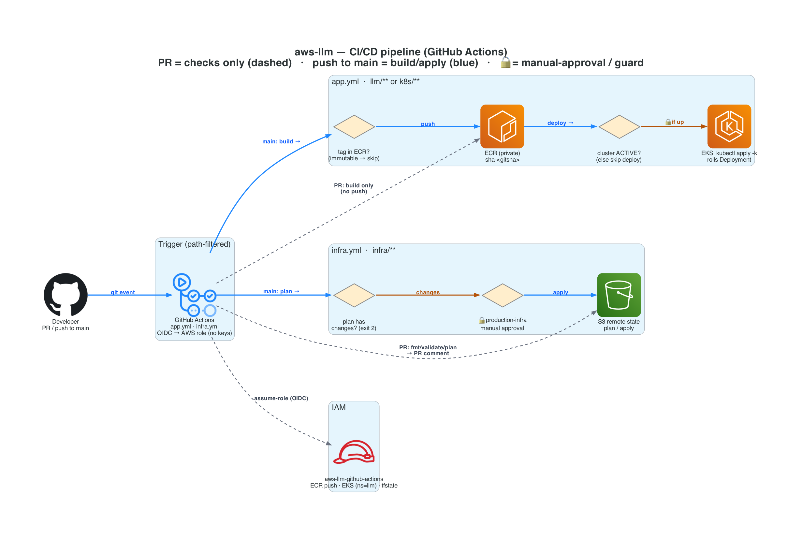
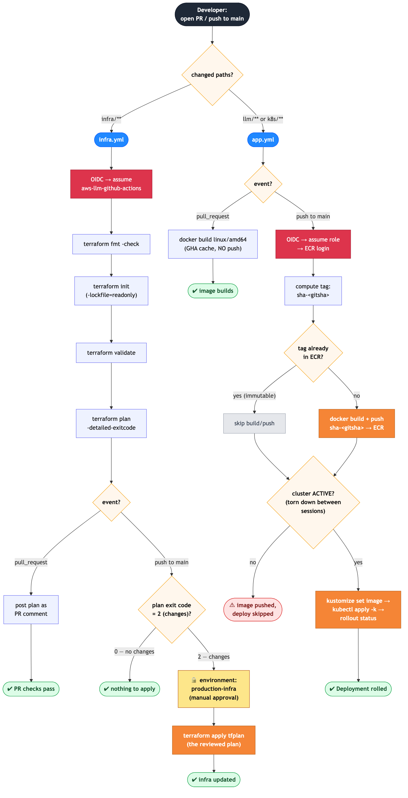

# aws-llm — CI/CD Pipeline

Two GitHub Actions workflows, split by changed path, both authenticating to AWS
via **OIDC** (no long-lived keys). Sources:
[`.github/workflows/app.yml`](../.github/workflows/app.yml) (image + deploy) and
[`.github/workflows/infra.yml`](../.github/workflows/infra.yml) (Terraform).

## Overview

*Icon overview (regenerate: `python3 docs/cicd_diagram.py`). The detailed
decision flowchart below is the source of truth for branch/gate logic.*

## Full decision flow

*Regenerate: `mmdc -i docs/cicd.mmd -o docs/cicd.png` (or paste
[`cicd.mmd`](cicd.mmd) into [mermaid.live](https://mermaid.live)).*

---

## How it works

### `infra.yml` — Terraform lifecycle (triggers on `infra/**`)

- **On a PR:** assume the OIDC role → `terraform fmt -check` → `init`
  (`-lockfile=readonly`) → `validate` → `plan -detailed-exitcode`. The plan is
  posted back as a **PR comment** so the change is reviewable inline.
- **On push to `main`:** same up to `plan`, then a gate — apply runs **only if
  the plan reported changes** (`-detailed-exitcode` = 2). If it does, the job
  enters the **`production-infra` GitHub Environment**, which requires a
  **manual approval** before `terraform apply` runs the *exact* reviewed plan
  (uploaded as an artifact from the plan job).

### `app.yml` — image build + deploy (triggers on `llm/**` or `k8s/**`)

- **On a PR:** `docker build` for `linux/amd64` with a GHA layer cache to catch
  Dockerfile breakage — **no push** (keeps unmerged images out of ECR).
- **On push to `main`:** assume the OIDC role → ECR login → compute the tag
  `sha-<gitsha>`. Two guards make it safe and cheap:
  1. **Idempotency guard** — ECR tags are immutable, so if `sha-<gitsha>`
     already exists, the build/push is **skipped** (a re-run on the same commit
     won't fail).
  2. **Cluster guard** — the GPU cluster is torn down between sessions to save
     cost, so deploy runs **only if the cluster is `ACTIVE`**. Otherwise the
     image is pushed and the deploy is skipped (not a failure).
  When the cluster is up: `kustomize edit set image` pins the new tag →
  `kubectl apply -k k8s/` (idempotent: creates the resources on a fresh cluster
  or rolls the Deployment) → `kubectl rollout status`.

### Shared auth — the OIDC role

Both workflows assume **`aws-llm-github-actions`** (defined in
[`infra/cicd.tf`](../infra/cicd.tf)) via GitHub OIDC. Its trust policy is scoped
to this repo's `main` branch and PRs; its permissions are least-privilege: ECR
push, EKS access to the `llm` namespace only, and read/write on the Terraform
state bucket.

## Why this shape

- **Path filters** keep the two lifecycles independent — an infra change doesn't
  rebuild the image, and vice-versa.
- **PR = checks, `main` = apply** gives fast, safe feedback on PRs while keeping
  anything that mutates AWS behind a merge.
- **OIDC over static keys** means no long-lived AWS credentials live in GitHub.
- **The two guards** (immutable-tag skip, cluster-up check) make re-runs
  idempotent and tolerate the cost-saving teardown of the GPU cluster.
- **The `production-infra` approval gate** puts a human in front of any change
  to live infrastructure (which includes a ~$730/mo GPU node group).
